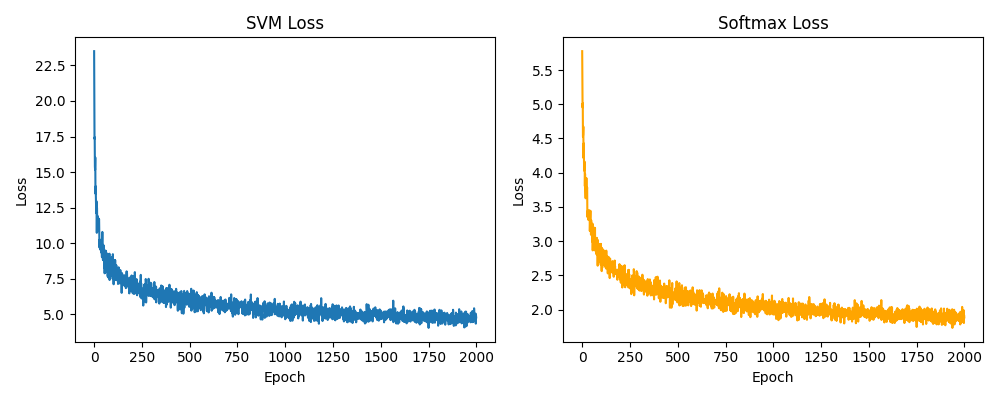
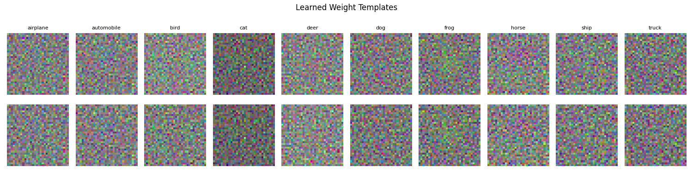

# Linear Classification on CIFAR-10

Implementation of two linear classifiers — **SVM (Hinge Loss)** and **Softmax (Cross-Entropy Loss)** — trained from scratch using NumPy on the CIFAR-10 dataset.

---

## Overview

This assignment implements linear classification, where the score function is defined as:

```
f(x, W) = Wx
```

where `x` is a flattened image vector and `W` is the learned weight matrix. Two different loss functions are explored and compared.

---

## File Structure

```
├── linear_classification.py   # Main implementation
├── README.md                  # This file
├── loss_curve.png             # Generated after running
├── weight_templates.png       # Generated after running
└── data/
    └── cifar-10-batches-py/   # CIFAR-10 dataset (download separately)
        ├── data_batch_1
        ├── data_batch_2
        ├── data_batch_3
        ├── data_batch_4
        ├── data_batch_5
        └── test_batch
```

---

## Dataset

**CIFAR-10** consists of 60,000 32×32 color images across 10 classes:

`airplane, automobile, bird, cat, deer, dog, frog, horse, ship, truck`

- Training set: 50,000 images
- Test set: 10,000 images
- Each image is flattened to a 3,072-dimensional vector (32 × 32 × 3)

### Download

```bash
wget https://www.cs.toronto.edu/~kriz/cifar-10-python.tar.gz
tar -xzvf cifar-10-python.tar.gz -C data/
```

---

## Preprocessing

1. **Zero-centering** — subtract the per-pixel mean computed from the training set
2. **Bias trick** — append a constant `1` to each input vector, making the weight matrix absorb the bias term (input dimension becomes 3,073)

---

## Loss Functions

### 1. SVM — Multiclass Hinge Loss

For each training example, the hinge loss is:

```
L_i = Σ_{j ≠ y_i} max(0, s_j - s_{y_i} + Δ)
```

where `Δ = 1` (margin), `s_j` is the score for class `j`, and `y_i` is the correct class.

The total loss with L2 regularization:

```
L = (1/N) Σ L_i + λ * ||W||²
```

### 2. Softmax — Cross-Entropy Loss

Scores are converted to probabilities via the softmax function:

```
P(y = k | x) = exp(s_k) / Σ_j exp(s_j)
```

The cross-entropy loss:

```
L_i = -log P(y = y_i | x_i)
```

The total loss with L2 regularization:

```
L = (1/N) Σ L_i + λ * ||W||²
```

> Numerical stability: the maximum score is subtracted before exponentiation to prevent overflow.

---

## Optimization

Mini-batch **Stochastic Gradient Descent (SGD)**:

```
W ← W - α * ∇_W L
```

| Hyperparameter | SVM | Softmax |
|---|---|---|
| Learning rate (α) | 5e-7 | 1e-6 |
| Regularization (λ) | 1e-4 | 1e-4 |
| Epochs | 2,000 | 2,000 |
| Batch size | 512 | 512 |

---

## Requirements

```bash
pip install numpy matplotlib
```

- Python 3.7+
- NumPy
- Matplotlib

---

## How to Run

```bash
python linear_classification.py
```

The script will:
1. Load and preprocess the CIFAR-10 dataset
2. Train the SVM classifier and print loss every 20 epochs
3. Train the Softmax classifier and print loss every 20 epochs
4. Report train/test accuracy for both models
5. Save `loss_curve.png` — training loss curves side by side
6. Save `weight_templates.png` — learned weight templates visualized as images

---

## Results

| Model | Train Accuracy | Test Accuracy |
|---|---|---|
| SVM (Hinge Loss) | 36.86% | **34.09%** |
| Softmax (Cross-Entropy) | 36.38% | **34.73%** |

Both models converge smoothly over 2,000 epochs. Softmax slightly outperforms SVM on the test set, which is consistent with the probabilistic nature of cross-entropy loss providing a softer and more informative gradient signal during training.

### Loss Curves



Both loss curves show rapid convergence in the early epochs and stabilize after approximately 500 epochs, confirming that the hyperparameters are well-tuned.

### Weight Templates



The learned weight templates appear noisy, which is expected for linear classifiers on CIFAR-10. Since each class is represented by a single weight vector, the model averages over all intra-class variations (e.g., different poses, backgrounds, lighting), resulting in blurry prototype-like templates. This is a fundamental limitation of linear classification rather than an implementation issue.

---

## Implementation Notes

- All computations are done with **NumPy only** (no deep learning frameworks)
- Gradients are derived and implemented analytically
- The bias term is handled via the **bias trick** rather than a separate parameter
- Both loss functions share the same SGD training loop for a fair comparison