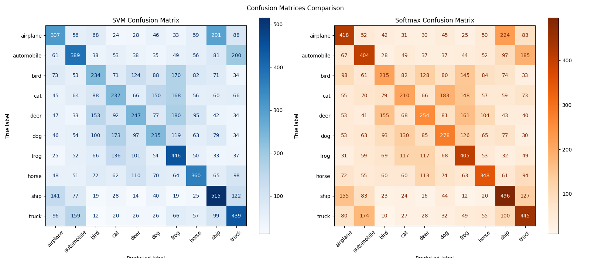

# Linear Classification on CIFAR-10

This project implements two linear classifiers from scratch using NumPy and evaluates their performance on the CIFAR-10 dataset:

* Linear SVM (Hinge Loss)
* Softmax Classifier (Cross-Entropy Loss)

The project includes data preprocessing, model training with Stochastic Gradient Descent (SGD), performance evaluation, and visualization of learning results.

---

## Project Structure

```text
LINEARCLASSIFICATION_CIFAR10
│
├── data/
│   └── cifar-10-batches-py/
│
├── linear_classification.py
├── loss_curve.png
├── weight_templates.png
├── confusion_matrix.png
└── README.md
```

---

## Dataset

This project uses the CIFAR-10 dataset.

### Dataset Information

* 50,000 training images
* 10,000 test images
* 10 object categories
* Image size: 32 × 32 RGB

Classes:

1. Airplane
2. Automobile
3. Bird
4. Cat
5. Deer
6. Dog
7. Frog
8. Horse
9. Ship
10. Truck

Dataset Download:

https://www.cs.toronto.edu/~kriz/cifar.html

---

## Data Preprocessing

Before training, the following preprocessing steps are applied:

### 1. Zero-Centering

The mean pixel value of the training set is computed and subtracted from both training and test data.

```python
mean = X_train.mean(axis=0)
X_train -= mean
X_test -= mean
```

### 2. Bias Trick

A column of ones is appended to each sample to incorporate the bias term into the weight matrix.

```python
X_train = np.hstack([X_train, np.ones((X_train.shape[0], 1))])
```

---

## Implemented Models

### Linear SVM

The Linear SVM classifier uses the multiclass Hinge Loss.

Features:

* Margin-based classification
* L2 regularization
* Mini-batch SGD optimization

---

### Softmax Classifier

The Softmax classifier converts class scores into probabilities and optimizes Cross-Entropy Loss.

Features:

* Probability-based classification
* Numerically stable implementation
* L2 regularization
* Mini-batch SGD optimization

---

## Training Configuration

| Parameter      | SVM  | Softmax |
| -------------- | ---- | ------- |
| Learning Rate  | 5e-7 | 1e-6    |
| Regularization | 1e-4 | 1e-4    |
| Epochs         | 2000 | 2000    |
| Batch Size     | 512  | 512     |

---

## Results

### Loss Curves

Training losses are recorded and visualized throughout the optimization process.

<p align="center">
  
</p>

---

### Weight Templates

The learned weight vectors are reshaped into image form to visualize what each classifier learns for every class.

<p align="center">
  
</p>

---

### Confusion Matrices

Confusion matrices are generated to compare classification performance across all classes.

<p align="center">
  
</p>

---

## Main Functions

### Data Loading

* `load_batch()` – Loads a single CIFAR-10 batch file
* `load_cifar10()` – Loads the entire CIFAR-10 dataset

### Preprocessing

* `preprocess()` – Performs zero-centering and bias augmentation

### Loss Functions

* `svm_loss()` – Computes multiclass SVM loss and gradient
* `softmax_loss()` – Computes Softmax Cross-Entropy loss and gradient

### Training

* `train()` – Trains a model using Mini-Batch SGD

### Evaluation

* `get_accuracy()` – Computes classification accuracy
* `get_predictions()` – Generates predicted labels

### Visualization

* `plot_loss()` – Plots training loss curves
* `plot_weight_templates()` – Visualizes learned weight templates
* `plot_confusion_matrices()` – Generates confusion matrices

---

## Workflow

```text
Load CIFAR-10 Dataset
          ↓
Data Preprocessing
          ↓
Train Linear SVM
          ↓
Evaluate Performance
          ↓
Train Softmax Classifier
          ↓
Evaluate Performance
          ↓
Generate Visualizations
```

---

## Requirements

Install the required packages:

```bash
pip install numpy matplotlib scikit-learn
```

---

## Run

```bash
python linear_classification.py
```

Make sure the CIFAR-10 dataset is located at:

```text
./data/cifar-10-batches-py
```

---

## Conclusion

This project demonstrates how linear classifiers can be implemented from scratch using NumPy. By comparing Linear SVM and Softmax classifiers on CIFAR-10, we can better understand the differences between margin-based and probability-based classification approaches, as well as the impact of optimization and regularization on model performance.
